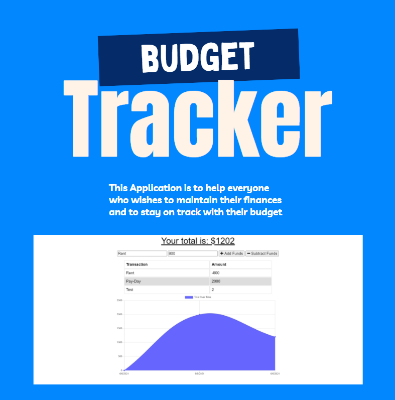

## Table of Contents

[Installation](#installation)

[Usage](#usage)

[Website](#website)

[Features](#features)

[License](#license)

[Questions](#questions)

## Website

> 🕸 Visit the website live [here](https://mysterious-beyond-96574.herokuapp.com/)

## Installation

> ⤵ To install, clone the repository and help yourself!

## Usage

> 📄 This project is used for the basic budgeter who wishes to keep track of how they use their money.

## Features

> 💻 Some cool features of this project are that it connects to IndexedDB which lets the user work offline on their budget. It also has a cool manifest for when phone users wish to use this app on their homescreen. (Including but not limited to 5+ different logo sizes)

## License

> 📇 These are the licences used in this project.

## Questions

> 

> 👦 Contact Me: [robertmcshinsky](https://github.com/robertmcshinsky)
> Email: robert.mcshinsky@gmail.com
